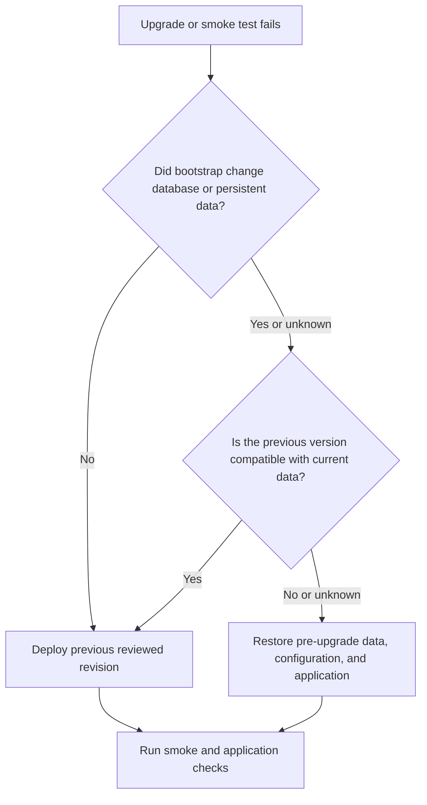

# Upgrades and rollback

An upgrade replaces the deployed application build and recreates the topology while preserving declared named volumes and bind-mounted data. It is not a fresh installation, and it does not prove that an older application version can use data changed by the upgrade.

This guide distinguishes:

- **application rollback**: deploy the previous application revision while keeping current persistent data;
- **full rollback**: restore the previous application revision together with the compatible pre-upgrade data and configuration.

## 1. Before upgrading

Start only when:

- the target tag or commit is reviewed and recorded;
- configuration changes are understood;
- profile, add-on, and external-dependency changes are understood;
- database and persistent-format changes have been reviewed;
- a usable backup exists for every state the upgrade can change;
- the previous revision/image and rollback decision are recorded.

Use [Backups and restore](backups-and-restore.md) for backup scope and recovery testing. Use the deployment-specific `LEAME.md` for actual hosts, settings paths, backup identifiers, and commands.

## 2. Review the change

Review:

- application release and upgrade notes;
- added, removed, or changed configuration variables;
- committed database migrations and any ordered data transformation;
- persistent-file format changes;
- selected profile and add-on changes;
- image, database, identity, storage, and other external dependencies.

If the generated deployment baseline may have changed, check it against the approved standards revision:

```bash
python3 /path/to/buisciii-deployment-standards/scripts/scaffold.py \
  check /path/to/application
```

Resolve and commit synchronization changes before the production upgrade. See [Scaffold workflow](scaffold-workflow.md); passing this check proves synchronization, not production readiness.

## 3. Back up what may change

Before upgrading, record and protect, where applicable:

- application and add-on databases;
- uploads, documents, datasets, and other persistent files;
- protected production configuration;
- identity-provider state;
- the current Git revision and image identifiers.

An image or Git revision is not a backup of mutable data. Keep exact backup and restore commands in [Backups and restore](backups-and-restore.md) and `LEAME.md`, not here.

## 4. Run the upgrade

Use the engine that owns the deployment and supply the same production configuration mappings used for installation. For example:

```bash
bash container_install.sh \
  --action upgrade \
  --engine podman \
  --git_revision <reviewed-tag-or-commit> \
  --install_conf_map example-app,deployment/settings/example-app_production_settings.txt
```

Replace `podman` with `docker` for a Docker-managed deployment, and replace the component and path with the generated mappings.

The installer:

1. validates arguments, selected settings, Compose, and cross-service configuration;
2. prepares runtime configuration, host paths, and host permissions;
3. rebuilds application images and add-on images that declare a build;
4. recreates the complete topology while preserving declared volumes and binds;
5. waits for each application readiness contract;
6. repairs declared running-container mounts;
7. runs profile bootstrap callbacks;
8. runs the generated smoke test.

A failure stops the installer, but earlier stages may already have rebuilt images, recreated containers, or changed application data. Do not assume a failed command left the previous deployment untouched.

## 5. Profile and add-on behavior

### Django

Django bootstrap checks database connectivity and runtime configuration, runs deployment checks, verifies that committed migrations are complete, runs optional pre-migration hooks, applies `migrate --noinput`, runs optional post-migration hooks, collects static files, and verifies migration state.

Initial tables are loaded during an upgrade only when `--tables` is explicitly supplied. `--script_before` and `--script_after` pass reviewed Django-extensions runscript hooks around migration. Use these options only when the application release procedure requires them; see the generated `.github/DJANGO_MIGRATIONS.md`, the [Django profile](../profiles/django.md), and the [installer reference](../reference/scripts/container-install.md).

The installer does not generate migrations. Releases must contain reviewed migration files. Production upgrades do not load test fixtures or demo data.

### Next.js and React/Vite

These profiles rebuild their image and recreate their service. Their current bootstrap callbacks perform no runtime database or migration step. Validate build-time public configuration because changing it requires a rebuilt frontend image.

### Add-ons

All selected services are recreated as part of the Compose topology. Add-on images that declare a build are rebuilt through Compose. The common installer does not define universal add-on migration or rollback semantics; follow the selected add-on's generated operations and release notes.

## 6. Validate the new deployment

An upgrade is accepted only after:

- the installer and generated smoke test pass;
- expected services are running and healthy;
- Django migration state is correct where applicable;
- application-specific user workflows pass;
- external database, identity, email, storage, proxy, and other required integrations work;
- declared persistent data remains available;
- the deployed revision and resulting image identifiers are recorded.

The generated smoke test validates Compose, profile checks, and application health endpoints. It does not replace application acceptance testing. See [Deployment workflow](deployment-workflow.md).

## 7. Application rollback

Application rollback means running the previous application image/revision while keeping the current persistent data.

This is safe only when the previous version supports the current database schema and persistent-file formats. The standard cannot determine that compatibility automatically.

When compatibility is confirmed, run the supported upgrade path with the previous reviewed revision and the same protected mappings:

```bash
bash container_install.sh \
  --action upgrade \
  --engine podman \
  --git_revision <previous-reviewed-revision> \
  --install_conf_map example-app,deployment/settings/example-app_production_settings.txt
```

Use `docker` when that engine owns the deployment. Run smoke and application checks again. There is no separate `rollback` installer action.

## 8. Full rollback

Full rollback restores the previous application version together with the data and configuration state captured before the upgrade. Use it when the old version is incompatible with the new schema or persistent formats, or when compatibility is unknown.

The deployment runbook should:

1. stop or isolate public writes;
2. restore databases from the selected recovery point;
3. restore affected volumes and bind-mounted files;
4. restore protected configuration if it changed;
5. deploy the recorded compatible revision/image;
6. repair declared permissions where required;
7. start dependencies and applications in the documented order;
8. rerun smoke and application acceptance checks;
9. reopen access only after approval.

Use [Backups and restore](backups-and-restore.md) for recovery sequencing. The installer does not automatically reverse migrations or restore data.

## 9. Failed upgrade



Preserve installer output, service logs, image identifiers, and database/migration evidence before recovery. If failure happened before build or recreation, correct the input and retry. If containers or data changed, use the decision above rather than repeatedly rerunning an unsafe operation.

## 10. Upgrade checklist

Before:

- Target revision is selected and reviewed.
- Scaffold and configuration differences are resolved.
- Migration and persistent-format impact is understood.
- Required backups are complete and verified.
- Previous revision and image identifiers are recorded.
- Application-only versus full rollback criteria are agreed.

After:

- Installer and smoke tests passed.
- Migration state and important user workflows passed.
- Integrations and persistent data were checked.
- Deployed revision, images, and backup evidence were recorded.
- `LEAME.md` was updated when operational details changed.

See [Configuration](configuration.md) for protected settings and validation. Full installer options and Django migration internals remain in their reference and profile documentation.
