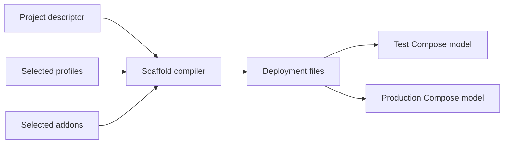
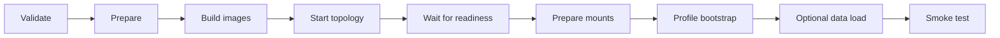

# Application installation contract

Status: Draft 0.2

## 1. Purpose and scope

This document defines the common contract for deploying a BU-ISCIII application from this repository's scaffold. It covers generated deployment files, ownership, configuration, installation, permissions, and verification.

Framework-specific behavior is supplied by a **profile**. Optional supporting services are supplied by **addons**. Requirements for a profile or addon apply only when it is selected.

## 2. Deployment model

A project descriptor defines one or more application services. Each service selects a profile, build context, image, and test and production configuration sources. It may also select addons. See the [project descriptor reference](../reference/project-descriptor.md) for fields and validation rules.

A **Compose service** describes one runnable part of the deployment. Compose uses the generated YAML model to create and connect the corresponding containers. A standalone deployment has one application service; an orchestrator deployment combines several application services and may build them from sibling repositories. At most one service owns the current repository through a build context of `.`.

The scaffold generates separate test and production Compose models from the same descriptor. Service keys are stable deployment identities and SHOULD stay the same when a service is used alone or in a larger topology.

## 3. Generated deployment baseline

The scaffold produces the following baseline. Exact paths and ownership rules are listed in the [generated project structure reference](../reference/generated-project-structure.md).

| Group                             | Responsibility                                                                            |
| --------------------------------- | ----------------------------------------------------------------------------------------- |
| `README.md` and `LEAME.md`        | Developer guidance and the production operator runbook                                    |
| `container_install.sh`            | Host-side validation, build, startup, readiness, permissions, bootstrap, and verification |
| `install.sh`                      | Django staging and bootstrap; generated only for the Django profile                       |
| `Dockerfile` and startup script   | Profile-specific image build and repeatable container startup                             |
| Test and production Compose files | Services, networks, mounts, health checks, and persistence for each mode                  |
| `conf/`                           | Test templates, production templates, and configuration documentation                     |
| `scripts/smoke_test.sh`           | Common deployment checks plus profile checks                                              |
| `deployment/lib/container/`       | Synchronized copies of the shared deployment library                                      |

Generated shared libraries MUST remain synchronized with `lib/container/`. Application changes belong in the marked application-owned blocks and extension hooks, not in managed copies.

## 4. Ownership and supported deployment modes

An application repository MUST identify:

- the standalone and integrated deployment modes it supports;
- the repository or operator that owns each supported topology;
- its persistent data and externally managed dependencies; and
- any deployment mode it does not support.

The application repository owns its local profile artifacts and application-specific hooks. An orchestrator repository may own the combined Compose topology, service ordering, cross-service configuration, and addons. Infrastructure such as DNS, TLS, external databases, backups, and identity MAY be supplied outside the application repository when that ownership is stated.

Unsupported modes MUST be explicit. A documented production mode is not supported unless the required production configuration and Compose model are present.

## 5. Installation lifecycle

`container_install.sh` implements the common container lifecycle:

1. validate arguments and configuration;
2. prepare host sources, the protected Compose environment, and permissions;
3. build application images;
4. recreate and start the complete topology;
5. wait for each application service to become ready;
6. prepare writable mounts inside running containers;
7. run profile-specific bootstrap;
8. load allowed application data when requested; and
9. run the generated smoke test.

A readiness check establishes that a service can proceed to bootstrap; it is not the final acceptance test. Detailed interfaces are documented for [`container_install.sh`](../reference/scripts/container-install.md), [`install.sh`](../reference/scripts/install.md), [`container_start.sh`](../reference/scripts/container-start.md), and [`smoke_test.sh`](../reference/scripts/smoke-test.md).

### Django stage and bootstrap

Django separates **stage** from **bootstrap**. Stage installs dependencies and copies application files into the image. It does not access the database or run migrations. Bootstrap runs after the service is ready and performs runtime checks, migration hooks, committed migrations, optional fixtures, static-file collection, and migration verification.

This separation keeps database work out of image builds and makes container startup repeatable. Production Django settings are rendered on the host and passed to bootstrap as a temporary protected file; they are not rendered into the production image.

## 6. Configuration and secrets

Test configuration contains disposable values and may be committed. Production configuration is prepared from a generated template and MUST use a protected, non-committed settings file. The installer rejects a production configuration that still contains an active `CHANGE_ME` assignment.

The installer combines service configuration into a generated Compose environment file with mode `0600`. Build configuration controls how an image is created; runtime configuration is supplied when services start or bootstrap. Values exposed to browser code by frontend profiles are build-time public configuration and MUST NOT contain secrets.

For Django production builds, the settings source is available to the build as an ephemeral build secret only. Django settings are rendered outside the image so production secrets are not stored in image layers. During bootstrap, the settings file copied into the container is restricted to the application identity and removed after use.

Applications MUST keep production secrets out of committed files and image layers. The repository does not require a particular external secret manager. See the [configuration guide](../guides/configuration.md) and [configuration variable reference](../reference/configuration-variables.md).

## 7. Containers, permissions, and storage

The generated deployment supports Docker and Podman. Docker uses `docker compose`. Podman uses `podman-compose` when available, otherwise `podman compose`. Docker is not required to run rootless.

Rootless Podman maps container users through a user namespace. When ordinary host ownership operations fail because of that mapping, the shared helpers use `podman unshare` fallbacks. The same fallback is not applied to Docker.

A **bind mount** exposes a declared host path inside a container. A **named volume** stores persistent data in storage managed by the container engine. Profiles and addons declare the mounts they need. Host-side permission rules and permissions applied inside running containers remain separate because they refer to different path namespaces.

Permission handling MUST operate only on declared paths. Each profile and addon keeps its own permission specification. `fix-permissions` is a repair action: it MUST NOT build images, bootstrap applications, migrate databases, or load data.

Persistent application data MUST remain outside replaceable container layers. The application documentation and production Compose model MUST agree on which databases, uploaded files, logs, configuration, and addon data persist. Detailed security and SELinux requirements belong in [security requirements](security-requirements.md).

For background on these concepts, see Docker's documentation for [Compose](https://docs.docker.com/compose/intro/compose-application-model/) and [container storage](https://docs.docker.com/engine/storage/), and Podman's [rootless mode](https://docs.podman.io/en/stable/markdown/podman.1.html#rootless-mode).

## 8. Deployment operations

The generated interface provides these operations:

| Operation         | Contract                                                                                                                                   |
| ----------------- | ------------------------------------------------------------------------------------------------------------------------------------------ |
| Install           | Validate, build, start, bootstrap as required, and run smoke tests                                                                         |
| Upgrade           | Preserve persistent data, rebuild selected application images, run upgrade bootstrap, and verify                                           |
| Permission repair | Repair declared host and running-container paths without build or bootstrap                                                                |
| Validation        | Reject invalid actions, engines, services, paths, unresolved production placeholders, and invalid Compose models before deployment changes |
| Smoke test        | Check the Compose model and service state, then run generated profile checks                                                               |

Test installations MAY load application-provided disposable data when the application implements that capability. Production MUST NOT load demo data implicitly. A production demo import is allowed only for a fresh install with an explicit existing file, and it disables application test fixtures for that operation.

Installation and upgrade MUST finish with the smoke test. An installer exit status alone is not acceptance evidence. Exact options and recovery procedures belong in the script reference and operational guides.

## 9. Documentation and operations

`README.md` is the application and developer deployment guide. It MUST explain the topology, prerequisites, supported modes, configuration, test and production entry points, persistence, routine operations, and where to find recovery information.

`LEAME.md` is the concrete production operator runbook. It MUST identify the deployed revision, infrastructure and configuration inputs, installation and upgrade procedure, permission repair, smoke tests, backup and restore actions, rollback decisions, diagnostics, and operational ownership. An approved runbook MUST NOT contain unresolved `CHANGE_ME` values.

Procedures belong in the relevant guide or generated template rather than in this contract. See the [documentation guide](../guides/documentation-files.md).

## 10. Profiles and addons

A **profile** owns framework-specific build, runtime, readiness, bootstrap, and smoke-test behavior. The scaffold currently supports:

- `django`;
- `nextjs`; and
- `react-vite`.

An **addon** is an optional supporting service or integration assembled around the selected applications. The scaffold currently supports:

- `apache`;
- `keycloak`;
- `nextstrain`; and
- `samba`.

The Samba addon is test-only in its current templates. Other addons may be limited to selected modes through their descriptor configuration. Addons MUST not be treated as application build/bootstrap services unless their template explicitly participates in those phases.

## 11. Worked example

The following example shows how the contract fits together for one application. It is illustrative; names, paths, ports, and infrastructure choices are not universal requirements.

An iSkyLIMS repository declares one Django service named `iskylims`. Its descriptor selects the Django profile, uses build context `.`, and enables the Apache addon for the production entry point. The generated project contains the Django Dockerfile and installer, test and production Compose files, protected configuration templates, the runtime entrypoint, and smoke tests.

For a local test installation, the operator selects the test Compose model and committed disposable settings. Compose starts the application and its test dependencies on loopback-bound ports. The installer waits for readiness, bootstraps Django, optionally loads supported test data, and runs the smoke test.

For production, the operator copies the production template to a protected, ignored settings file and replaces every `CHANGE_ME` value. The installer validates that file, builds the image without rendering production Django settings into it, starts the topology, prepares declared mounts, runs database bootstrap once, and finishes with the smoke test.

In an integrated deployment, an orchestrator may reuse the same stable `iskylims` service identity and point its build context at the application repository. The orchestrator owns the combined Compose model and cross-service configuration; the application repository continues to own its Django profile artifacts and application-specific extension hooks.

This example is compliant only when the infrastructure and security requirements also apply successfully. Passing scaffold generation alone does not prove that DNS, TLS, backups, production access, or recovery are ready.

## 12. Compliance

`MUST` requirements define compliance with this contract. Profile requirements apply only to services selecting that profile. Addon requirements apply only when the addon is selected and enabled for the deployment mode.

Intentional deviations MUST be documented with their scope, reason, owner, and review decision. See [exceptions and compliance](exceptions-and-compliance.md).
