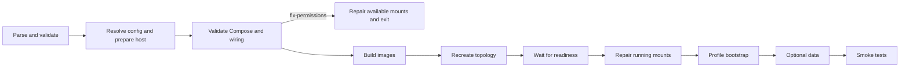

# `container_install.sh` reference

## Purpose

`container_install.sh` is the generated host-side deployment orchestrator. It
validates arguments and configuration, selects Docker or Podman, prepares host
sources and permissions, validates Compose and deployment wiring, builds and
starts services, waits for readiness, runs profile bootstrap and optional data
loading, and dispatches smoke tests.

## Command syntax

```bash
bash container_install.sh [options]
```

With no options, it performs a production `install` using Docker and the Git
revision `current`. It uses generated default configuration sources and
`docker-compose.prod.yml`.

## Actions

| Action | Purpose | Builds images | Starts/recreates | Bootstrap | Data loading |
|---|---|---:|---:|---:|---:|
| `install` | Fresh deployment lifecycle | Yes | Yes | Yes | When allowed |
| `upgrade` | Rebuild and redeploy while preserving mounted persistent state | Yes | Yes | Yes, as `upgrade` | No |
| `fix-permissions` | Repair declared host paths and mounts in running containers | No | No | No | No |

`install` passes `install` to profile bootstrap. `upgrade` passes
`upgrade`; table loading is opt-in on upgrades. Neither Compose recreation
nor this script deletes named volumes or bind-mounted persistent data. This is
preservation, not a backup.

`fix-permissions` still resolves configuration, selects the engine, prepares
host sources and host permissions, generates and loads the Compose environment,
and validates Compose and deployment wiring. It then repairs mounts only for
permission services whose containers are resolvable. Missing containers are skipped. A
stopped container can still resolve; its in-container repair may therefore fail. It exits before builds, Compose `up`,
readiness, bootstrap/migrations, data loading, and smoke tests.

## Options

| Option | Argument | Applies to | Description |
|---|---|---|---|
| `--action` | `install\|upgrade\|fix-permissions` | all modes | Select action. Default: `install`. |
| `--test` | none | all actions | Select test mode. Default: production. |
| `--engine` | `docker\|podman` | all actions | Select engine. Default: `docker`. |
| `--git_revision` | branch, tag, commit, or `current` | builds/bootstrap | Revision passed to profile behavior. Default: `current`. |
| `--install_conf` | path | configuration | Override only the first application service's settings. |
| `--install_conf_map` | `component,path` | configuration | Repeatable application/addon settings override. |
| `--compose_file` | path | all actions | Override the mode-specific Compose file. |
| `--script_before` | `name[,arg...]` | Django bootstrap | Repeatable pre-migration application script. |
| `--script_after` | `name[,arg...]` | Django bootstrap | Repeatable post-migration application script. |
| `--script` | `name[,arg...]` | Django bootstrap | Alias for `--script_after`. |
| `--tables` | none | Django bootstrap | Request initial tables; opt-in on upgrade. Clears `--skip_tables`. |
| `--skip_tables` | none | Django bootstrap | Skip initial tables on install. Clears `--tables`. |
| `--demo_data` | path | single-service install | Compatibility form of `--demo_data_map`. |
| `--demo_data_map` | `service,path` | install | Repeatable explicit data import. |
| `--skip_demo_data` | none | install | Disable demo-data loading; conflicts with an explicit map. |
| `--skip_test_data` | none | test install | Passed to the application data loader. |
| `--skip_test_data_service` | service | test install | Repeatable per-service fixture skip. |
| `--help` | none | immediate | Print usage and exit successfully. |
| `--version` | none | immediate | Print generated installer version and exit successfully. |

The migration-script values identify scripts understood by Django's
`install.sh`; they are not arbitrary host shell commands. See
[`install.sh`](install.md).

## Configuration resolution

Each configured application or addon begins with its descriptor-generated
default. Overrides are applied in this order:

```text
generated default
    ↓
--install_conf (first application service only)
    ↓
--install_conf_map component,path (last mapping wins)
```

`--install_conf_map` accepts names in the generated `configured_services`
array. An unknown component or malformed mapping fails. Unlike demo-data maps,
duplicate configuration mappings are not rejected; later entries overwrite
earlier ones.

Relative configuration paths are resolved from the directory containing
`container_install.sh`. Every final path must be a file. In production, an
active uppercase assignment containing the exact text `CHANGE_ME` is rejected.
See [configuration variables](../configuration-variables.md).

## Compose selection and environment

Test defaults to `docker-compose.test.yml`; production defaults to
`docker-compose.prod.yml`. `--compose_file` replaces that selection.

Before any Compose command, the installer generates
`.env.<mode>.file` beside the installer (`.env.test.file` or
`.env.production.file`). It combines configuration sources, collision-safe
service prefixes, and generated deployment values for Compose interpolation.
The file is passed through `--env-file`.

## Deployment lifecycle

1. Parse CLI options.
2. Validate action, engine, data mappings, services, files, and option conflicts.
3. Resolve one protected configuration source per configured component.
4. Select the engine; select Compose; generate/load its environment; prepare
   host sources and host permissions; run Compose `config`; run
   `check_deployment_configuration`.
5. For `fix-permissions`, repair available running mounts and exit.
6. Build application services in declaration order, then addon build services.
7. Recreate and start the complete topology.
8. Wait for every application service's generated readiness contract.
9. Repair running mounts for application and selected addon services.
10. Run generated profile bootstrap for each application service.
11. Load application-owned test/demo data when requested and allowed.
12. Run the generated smoke test, print success, and show Compose service state.



### Validation before deployment changes

Before images or services change, the installer checks supported actions and
engines; demo-data consistency, service names, duplicates, and files;
configuration mappings and files; production placeholders; the selected
Compose file; the fully interpolated Compose model; and cross-service wiring
through `check_deployment_configuration`. Host-source creation and permission
changes happen before Compose validation, so these are pre-build side effects.

## Build and startup behavior

In test mode, each application service is built with:

```bash
compose --env-file .env.test.file -f <compose-file> build --no-cache <service>
```

In production, generated profile callbacks invoke the selected engine directly.
Each profile supplies only its supported build arguments. Django additionally
uses a build secret for protected configuration; direct builds avoid depending
on Compose `build.secrets` support. Next.js supplies its public build values,
and React/Vite supplies `VITE_API_BASE_URL`. Selected addon build services
(currently Nextstrain) are built with Compose in both modes.

After all builds:

```bash
compose --env-file <generated-env> -f <compose-file> up -d --force-recreate
```

This operates on the complete topology. Existing named volumes and bind-mounted
data are not removed.

## Readiness and bootstrap

For each application service, the installer must resolve a running container.
It polls every 2 seconds for up to 120 seconds until the profile readiness file
exists. On timeout it prints the last 200 container log lines and fails.

| Profile | Readiness file | Bootstrap |
|---|---|---|
| Django | `<INSTALL_PATH>/manage.py` | Stages protected runtime settings and calls `install.sh --bootstrap <action>`. |
| Next.js | `/app/.next/BUILD_ID` | No-op. |
| React/Vite | `/usr/share/nginx/html/index.html` | No-op. |

Readiness only permits bootstrap to continue; smoke tests provide the later
deployment check. Django production runtime settings are removed after the
bootstrap attempt. Detailed Django stages are in [`install.sh`](install.md).

## Test and demo data

Data loading exists only when the application-owned block sets
`application_supports_test_data=true` and implements
`load_test_deployment_data`.

| Situation | Result |
|---|---|
| Test + `install`, capability enabled, no explicit map | Calls the loader with the first application service and application defaults. |
| Production + `install` with explicit map(s) | Calls the loader once per mapped service/file and forces test fixtures off. |
| `upgrade` or `fix-permissions` | No data loading; explicit maps are rejected unless action is `install`. |
| Capability disabled + explicit map | Fails before deployment changes. |

`--demo_data` is valid only for a single application service and becomes a
mapping for that service. Map services must be application services; paths must
be non-empty existing files; duplicate demo mappings fail.
`--skip_demo_data` conflicts with explicit maps. In the default test-loader
path, `--skip_test_data_service` sets `skip_test_data=true` only when the
selected default service is listed. Unknown skipped services fail.

The `--tables`, `--skip_tables`, and migration-hook options are forwarded
only by the Django bootstrap callback. Their detailed install/upgrade behavior
belongs to [`install.sh`](install.md).

## Permission repair

There are two permission phases:

- Host bind sources are prepared before Compose validation and startup.
- Declared paths inside running mounts are repaired after application readiness.

`fix-permissions` executes the first phase, then applies the second phase only
where a container resolves. Missing containers are skipped, but a stopped
container may resolve and then fail the in-container operation. Normal install/upgrade requires every
permission-service container during the second phase. Application-only paths
belong in the marked hooks described by the
[customization guide](../../guides/container-install-customization.md).

## Docker and Podman

| Engine | Engine command | Compose selection |
|---|---|---|
| Docker | `docker` | `docker compose` |
| Podman | `podman` | `podman-compose` when installed; otherwise `podman compose` |

A missing engine or unavailable Podman Compose frontend fails during engine
selection. Docker is not required to run rootless. When ordinary ownership
operations fail, shared helpers can use `podman unshare` for rootless Podman;
Docker uses a narrowly bind-mounted helper container for supported fallback
operations.

## Generated callbacks and ownership

These are generated implementation interfaces, not application extension
points.

| Callback/mapping | Owner | Role |
|---|---|---|
| `default_service_install_conf` | descriptor/profile/addon assembly | Default settings path per configured component. |
| `service_build_context_dir`, `service_image_name`, `service_dockerfile`, `service_profile` | descriptor/profile | Build and profile metadata. |
| `service_readiness_path`, `service_container_install_conf` | profile | Readiness and in-container configuration path. |
| `prepare_application_host_sources` | profiles/addons | Render or create bind sources. |
| `prepare_host_bind_source_permissions` | profiles/addons/common template | Apply declared host permissions, then application hook. |
| `prepare_running_container_mount_permissions` | profiles/addons/common template | Apply declared running-mount permissions, then application hook. |
| `build_production_service`, `bootstrap_service` | profiles | Framework build and bootstrap behavior. |

Only the block between
`BEGIN BU-ISCIII APPLICATION: deployment-hooks` and its matching `END`
marker is application-owned. Its current hooks are
`load_test_deployment_data`, `set_application_host_bind_permissions`, and
`set_application_running_mount_permissions`. Shell functions outside that
block remain standard-managed. See the [customization guide](../../guides/container-install-customization.md).

## Smoke tests and failure behavior

The installer calls:

```text
scripts/smoke_test.sh --engine <engine> --compose_file <file> --env_file <generated-env>
```

It adds `--test` in test mode. See [`smoke_test.sh`](smoke-test.md).

The script uses `set -euo pipefail`: unhandled command failures, unset
variables, and failed pipeline commands abort execution. Invalid inputs,
missing configuration, invalid Compose, or invalid deployment wiring fail
before build/start. Readiness timeouts print logs. Build, startup, permission,
bootstrap, data-loader, and smoke-test failures abort at their current stage.

There is no automatic rollback. A failure after `up` can leave newly
recreated services running; a later bootstrap or smoke-test failure does not
restore the previous image or application state.

## Examples

```bash
# Test install
bash container_install.sh --test --action install --engine docker

# Production install
bash container_install.sh --action install --engine podman --git_revision v1.2.0

# Upgrade
bash container_install.sh --action upgrade --engine docker --git_revision v1.3.0

# Repair permissions
bash container_install.sh --action fix-permissions --engine podman

# Multi-service configuration overrides
bash container_install.sh --action install \
  --install_conf_map backend,/run/secrets/backend-settings \
  --install_conf_map portal,/run/secrets/portal-settings
```
