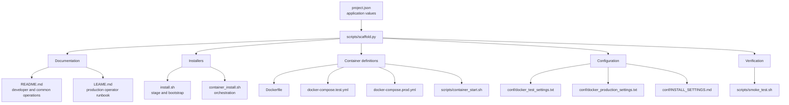
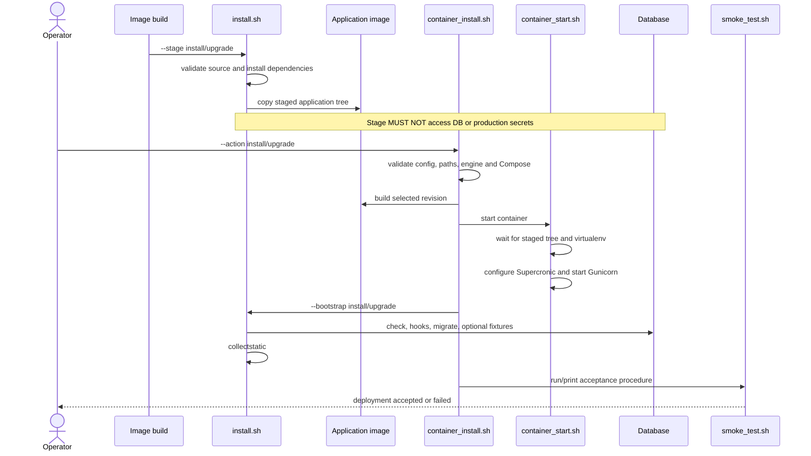
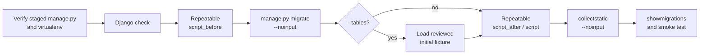
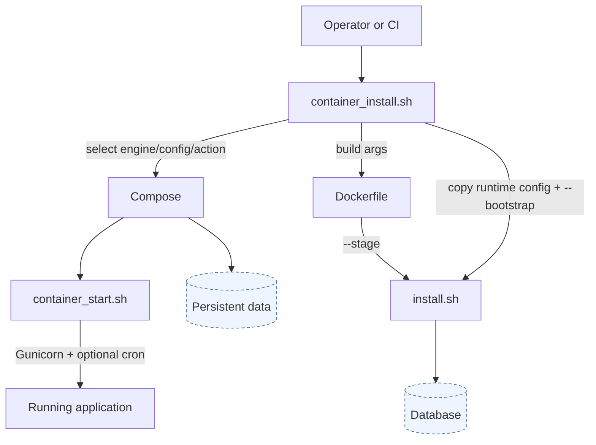
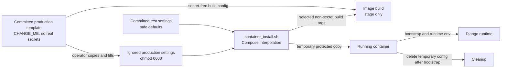
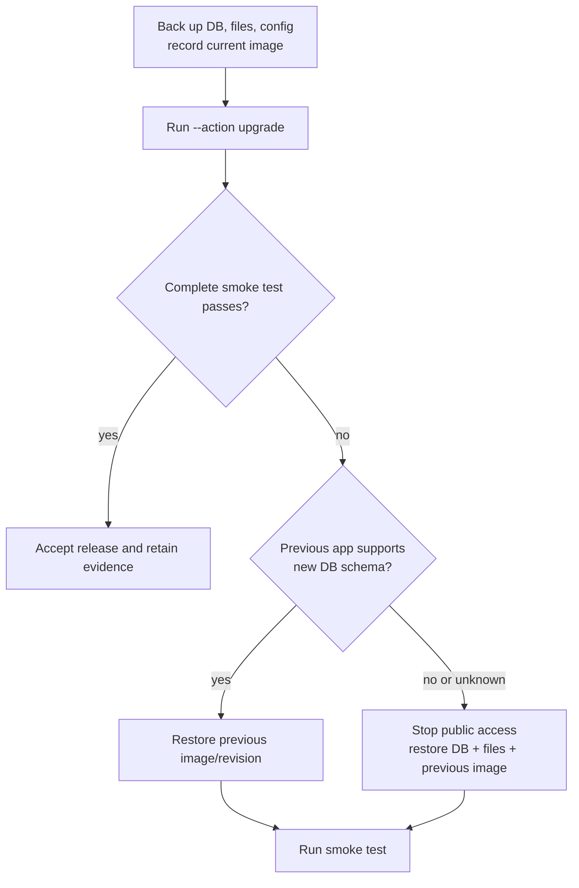
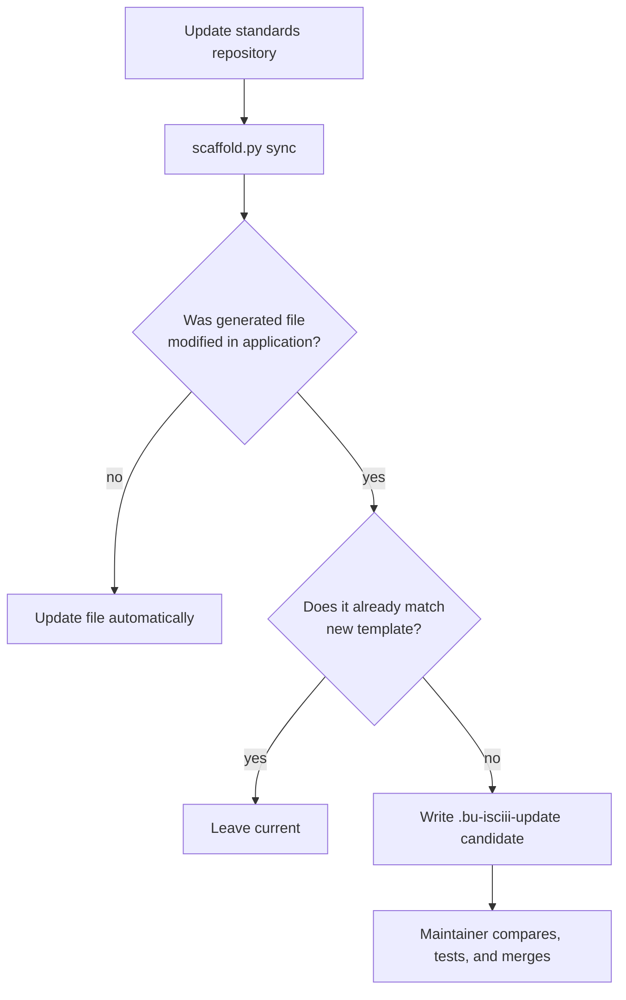

# Application Installation Contract

Status: Draft 0.1

This document defines what a complete BU-ISCIII installation procedure must
contain, which file owns each responsibility, and how the pieces work together.
Normative words are `MUST`, `SHOULD`, and `MAY`.

The supplied scaffold is a concrete Django/Gunicorn/MySQL implementation based
on the RELECOV Platform deployment pattern. Other technologies may implement
the same lifecycle differently, but must satisfy the same outcomes.

## 1. Start from the scaffold

Create a project descriptor from
[`project.json.example`](../scaffold/project.json.example):

```bash
cp scaffold/project.json.example /tmp/my-application.json
```

Fill the application name, slug, Django module, repository, ports, runtime
paths, UID/GID, Python version, and timezone. Generate the baseline:

```bash
python3 scripts/scaffold.py init /path/to/my-application \
  --config /tmp/my-application.json
```

The generated application has this installation structure:



Template references:

| Generated file | Source template | Required responsibility |
|---|---|---|
| `README.md` | [`README.md.tmpl`](../scaffold/templates/README.md.tmpl) | Test install, production overview, persistence, upgrade, rollback, operations, testing |
| `LEAME.md` | [`LEAME.md.tmpl`](../scaffold/templates/LEAME.md.tmpl) | Ordered production procedure with real host commands |
| `install.sh` | [`install.sh.tmpl`](../scaffold/templates/install.sh.tmpl) | Stage files/dependencies and bootstrap Django state |
| `container_install.sh` | [`container_install.sh.tmpl`](../scaffold/templates/container_install.sh.tmpl) | Validate, build, start, bootstrap, repair permissions |
| `Dockerfile` | [`Dockerfile.tmpl`](../scaffold/templates/Dockerfile.tmpl) | Immutable staged image and non-root runtime |
| Test Compose | [`docker-compose.test.yml.tmpl`](../scaffold/templates/docker-compose.test.yml.tmpl) | Isolated app and disposable database |
| Production Compose | [`docker-compose.prod.yml.tmpl`](../scaffold/templates/docker-compose.prod.yml.tmpl) | App, external database connection, persistent mounts |
| Entrypoint | [`container_start.sh.tmpl`](../scaffold/templates/scripts/container_start.sh.tmpl) | Runtime readiness, cron, development server or Gunicorn |
| Test settings | [`docker_test_settings.txt.tmpl`](../scaffold/templates/conf/docker_test_settings.txt.tmpl) | Safe disposable defaults |
| Production settings | [`docker_production_settings.txt.tmpl`](../scaffold/templates/conf/docker_production_settings.txt.tmpl) | Secret-free production template |
| Settings reference | [`INSTALL_SETTINGS.md.tmpl`](../scaffold/templates/conf/INSTALL_SETTINGS.md.tmpl) | Meaning and security classification of every setting |
| Smoke test | [`smoke_test.sh.tmpl`](../scaffold/templates/scripts/smoke_test.sh.tmpl) | Repeatable installation acceptance test |

Use the detailed
[`installation-checklist.md`](../templates/installation-checklist.md) to audit
the implementation and [`configuration-matrix.md`](../templates/configuration-matrix.md)
for cross-service settings.

## 2. Declare ownership and supported modes

Every component MUST state in its `README.md`:

- whether its repository owns standalone installation;
- which repository owns integrated installation;
- persistent data owned by the component;
- externally managed database, TLS, backup, DNS, email, and identity services;
- which deployment modes are supported.

Use an explicit table such as:

| Capability | Supported | Owner or command |
|---|---:|---|
| Local test | Yes | `container_install.sh --test` |
| Production containers | Yes | This repository |
| Bare metal | No | Explicitly unsupported |
| Upgrade | Yes | `--action upgrade` |
| Permission repair | Yes | `--action fix-permissions` |
| Backup and restore | Yes | Institutional DBA plus `LEAME.md` |

Unsupported modes MUST be marked unsupported. A missing production file while
the installer defaults to production is a contract failure.

## 3. Documentation contract

### `README.md`: application-facing guide

The generated [`README.md.tmpl`](../scaffold/templates/README.md.tmpl) provides
the required order. The application `README.md` MUST contain:

1. infrastructure overview and service topology;
2. repository checkout and required sibling layout;
3. supported deployment paths;
4. host and software prerequisites;
5. configuration preparation;
6. clean local test installation;
7. production installation summary;
8. stage/bootstrap explanation;
9. upgrade procedure;
10. persistent-data inventory;
11. backup, restore, and rollback summary;
12. routine commands, smoke tests, and troubleshooting.

Every command MUST state or imply the working directory and MUST distinguish
safe test values from production placeholders.

### `LEAME.md`: production operator runbook

The generated [`LEAME.md.tmpl`](../scaffold/templates/LEAME.md.tmpl) is the
execution checklist for operators. Before production approval it MUST contain
real values or references for:

- delivered revision and image digest;
- production topology, DNS, TLS, database, storage, and permissions;
- configuration creation and validation;
- pre-install and pre-upgrade backups;
- first install, upgrade, and permission repair commands;
- local and public smoke tests;
- database and filesystem restore;
- application-only rollback and full data rollback;
- common failure diagnostics and operational contacts.

No unresolved `CHANGE_ME` marker may remain in an approved production runbook.

## 4. Canonical command-line interface

Every installation script MUST recognize the following names. When an option is
not applicable, it MUST fail before modifying state and explain why; it must not
silently ignore the option.

```text
--action install|upgrade|fix-permissions
--test
--engine docker|podman
--git_revision <branch|tag|commit|current>
--install_conf <path>
--install_conf_map <service,path>
--compose_file <path>
--stage [install|upgrade]
--bootstrap [install|upgrade]
--script_before <script[,args]>
--script_after <script[,args]>
--script <script[,args]>
--tables
--skip_tables
--help
--version
```

Canonical examples:

```bash
# Isolated test installation
bash container_install.sh --test --action install \
  --engine docker --git_revision current \
  --install_conf conf/docker_test_settings.txt

# Production upgrade with ordered data transformations
bash container_install.sh --action upgrade --engine podman \
  --git_revision v2.1.0 \
  --install_conf conf/production_settings.txt \
  --script_before prepare_v2_data \
  --script_after verify_v2_data

# Internal image-build phase: no database or production secrets
bash install.sh --stage install --git_revision current \
  --install_conf conf/docker_production_settings.txt

# Internal runtime phase against the staged tree
bash install.sh --bootstrap upgrade \
  --install_conf /tmp/runtime_install_settings.txt \
  --skip_tables
```

Option semantics:

| Option | Required behavior |
|---|---|
| `--action` | Select install, upgrade, or permission repair; default is install |
| `--test` | Select isolated test mode; absence means production |
| `--engine` | Select Docker or Podman; default must be documented |
| `--git_revision` | Select branch, tag, commit, or `current` local committed sources |
| `--install_conf` | Select one non-committed runtime configuration |
| `--install_conf_map` | Repeatable configuration mapping for multi-service orchestrators |
| `--compose_file` | Override the mode-default Compose file |
| `--stage` | Dependencies and files only; never database work or runtime secrets |
| `--bootstrap` | Runtime checks, hooks, migrations, fixtures, and static collection |
| `--script_before` | Repeatable Django migration hook before `migrate` |
| `--script_after` | Repeatable hook after `migrate`; `--script` is its alias |
| `--tables` | Explicitly load the documented initial fixture |
| `--skip_tables` | Explicitly prevent fixture loading; default for production upgrades |
| `--help`, `--version` | Print and exit successfully without changing state |

Compatibility aliases such as `--install full|dep|app`, `--upgrade
full|dep|app`, and `--conf` MAY remain, but current documentation MUST use the
canonical interface.

Application-specific demo flags SHOULD use `--demo_data`, `--skip_demo_data`,
and `--skip_test_data`.

## 5. Stage, bootstrap, and runtime lifecycle

Stage and bootstrap are separate because the image must be restartable without
rerunning installation and because production secrets/database access must not
be required while building an image.



The bootstrap ordering is mandatory:



The scaffold implementations are
[`install.sh.tmpl`](../scaffold/templates/install.sh.tmpl),
[`container_install.sh.tmpl`](../scaffold/templates/container_install.sh.tmpl),
and [`container_start.sh.tmpl`](../scaffold/templates/scripts/container_start.sh.tmpl).

## 6. Script responsibilities

Responsibilities MUST not be duplicated ambiguously across entrypoint and
installer scripts.



### `install.sh`

MUST own dependency installation, application staging, ordered database
bootstrap, migration hooks, optional initial fixtures, and static collection.
It MUST fail if bootstrap is requested before staging.

### `container_install.sh`

MUST own argument validation, engine selection, Compose selection, host paths,
rootless permissions, image building, service startup/readiness, securely
passing runtime configuration, invoking bootstrap, diagnostics, and final URLs.

`fix-permissions` MUST NOT build images, migrate databases, or delete data.

### `container_start.sh`

MUST own only repeatable runtime startup: bounded wait for staged files,
virtualenv activation, safe runtime directories, optional Supercronic jobs,
development server selection, worker calculation, and `exec gunicorn`.

It MUST NOT migrate the database or load fixtures on every restart.

### `Dockerfile`

MUST install explicit system dependencies, call `install.sh --stage`, create a
numeric non-root runtime user, include the entrypoint, and define a health check.
It MUST NOT copy production secrets into an image.

### Compose files

Test Compose MUST provide an isolated database, health checks, loopback-bound
ports, and disposable named volumes. Production Compose MUST use the documented
database model, expose only required application/proxy ports, run as the
configured UID/GID, and mount every persistent path.

## 7. Configuration and secret flow

Use the generated
[`INSTALL_SETTINGS.md.tmpl`](../scaffold/templates/conf/INSTALL_SETTINGS.md.tmpl)
and the reusable
[`configuration-matrix.md`](../templates/configuration-matrix.md).

Every important setting MUST document its owner, requirement, secret status,
test default, build/runtime timing, and network scope (`public`, `host`,
`internal`, or `local`).



Production secrets MUST NOT be committed, printed, or baked into images.
Production settings MUST be ignored by Git, protected with mode `0600`, and
rejected while `CHANGE_ME` values remain. Shared issuer, audience, public URL,
database, proxy, and frontend values MUST have one documented source of truth.

## 8. Persistence, permissions, and destructive boundaries

The `README.md`, `LEAME.md`, and production Compose file MUST agree on every
persistent asset:

| Asset | Production expectation | Rebuild/upgrade behavior |
|---|---|---|
| Database | External or named persistent volume, explicitly documented | Preserved and backed up before migration |
| Uploaded documents | Host bind or named volume | Preserved |
| Identity data/keys | Persistent and backed up when applicable | Preserved |
| Logs | Host path or external logging service | Retained by policy |
| Static files | Named volume or replaceable build output | Regenerated safely |
| Image/source | Immutable and versioned | Replaceable |
| Runtime configuration | Secure external copy | Preserved outside image |

Each host path MUST state owner UID/GID, permissions, SELinux label, backup
method, and whether deletion is destructive. Rootless Podman ownership MUST be
tested with `podman unshare` where needed.

No installer may delete a database, volume, document tree, backup, or broad host
path without an explicit destructive option and clear confirmation by the
operator.

## 9. Upgrade, backup, restore, and rollback

Before an upgrade, `LEAME.md` MUST require:

1. supported source and target version confirmation;
2. release notes and configuration-difference review;
3. database and filesystem backup;
4. current revision/image digest recording;
5. rollback decision point;
6. explicit migration hooks and fixture choice;
7. post-upgrade smoke testing.



An upgrade MUST preserve persistent data. Production upgrades MUST not load
demo data or fixtures unless `--tables` is explicitly supplied. A backup is not
accepted as operationally valid until a restore has been tested.

## 10. Security requirements

Production deployment MUST:

- use TLS for external browser and API traffic;
- reject default/test credentials and unresolved placeholders;
- expose only required ports and keep databases private;
- use non-root containers and least-privilege database accounts;
- configure allowed hosts, CSRF, CORS, and forwarded headers explicitly;
- document authentication, authorization, SMTP, and identity dependencies;
- deliberately version external images and security updates;
- keep build context free of secrets, dumps, logs, virtualenvs, and VCS data.

See [Django](../profiles/django.md), [React/Vite](../profiles/react-vite.md),
[Keycloak](../profiles/keycloak.md), and [MySQL](../profiles/mysql.md) profiles
where applicable.

## 11. Acceptance and smoke testing

Installation succeeds only when a repeatable acceptance test passes. Extend
[`smoke_test.sh.tmpl`](../scaffold/templates/scripts/smoke_test.sh.tmpl) so it
verifies, as applicable:

1. expected services are running and healthy;
2. database connectivity and migration state;
3. application health and a real read operation;
4. static files and browser loading;
5. login, token issuer/audience, and authorization;
6. communication between integrated services;
7. email and scheduled jobs;
8. persistence after container restart/recreation.

An installation command returning zero is not sufficient acceptance evidence.

## 12. Synchronizing template improvements

Applications generated from this repository store their template values and
baseline checksums in `.bu-isciii-deployment/state.json`.

```bash
python3 scripts/scaffold.py sync /path/to/my-application
```



Synchronization MUST NOT overwrite locally modified application files. A
maintainer MUST review `.bu-isciii-update` candidates and rerun syntax, Compose,
installation, upgrade, and smoke tests after merging.

## 13. Completion evidence and exceptions

Complete the
[`installation-checklist.md`](../templates/installation-checklist.md) with links
to exact files, commands, logs, and test results.

Any unmet or inapplicable requirement MUST record:

- requirement and affected deployment mode;
- reason;
- responsible owner;
- compensating control or manual procedure;
- review date.

The installation procedure is complete only when the applicable checklist is
satisfied, recovery has been exercised, and intentional exceptions are visible.
