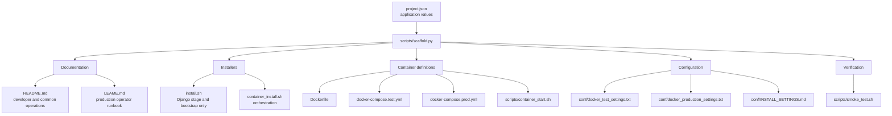
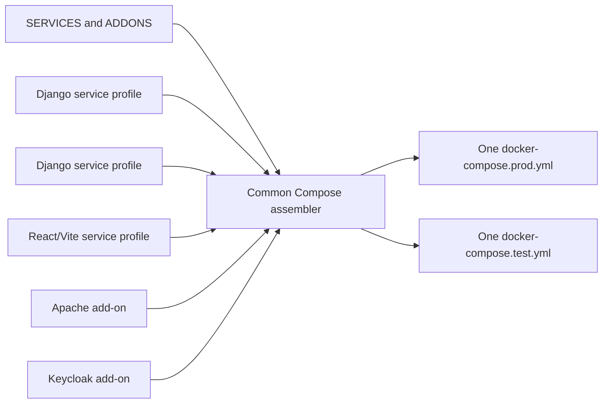
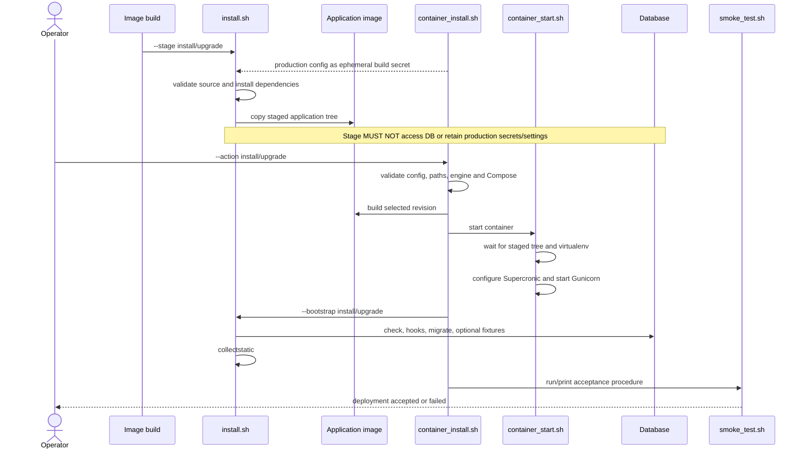
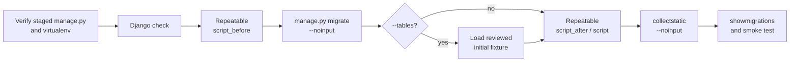
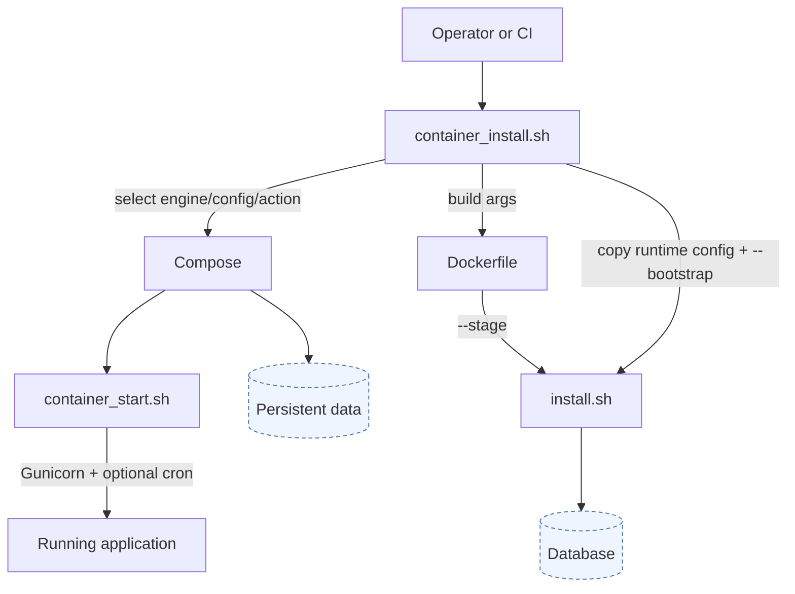
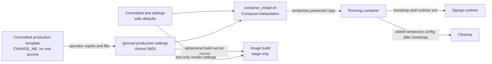
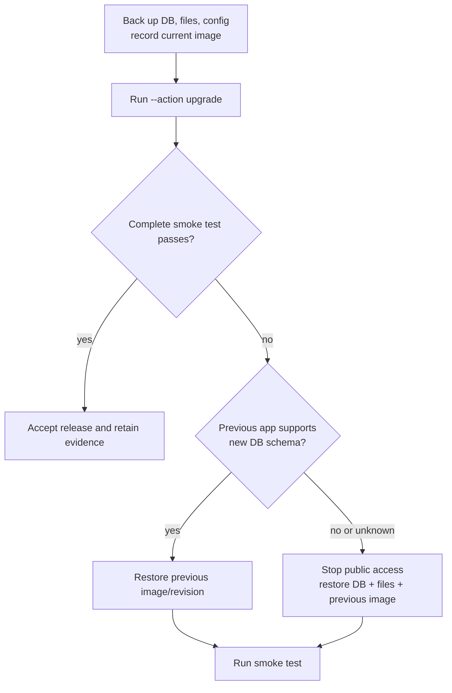
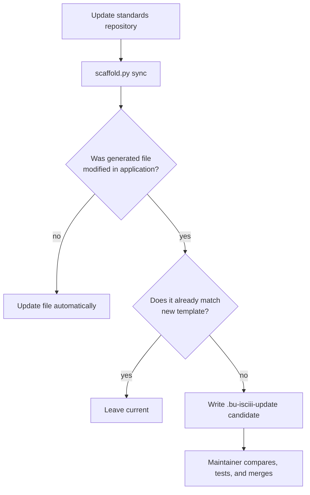

# Application Installation Contract

Status: Draft 0.1

This document defines what a complete BU-ISCIII installation procedure must
contain, which file owns each responsibility, and how the pieces work together.
Normative words are `MUST`, `SHOULD`, and `MAY`.

The supplied scaffold has concrete Django/Gunicorn/MySQL and React/Vite/Nginx
profiles. They implement the same deployment outcomes with different build,
bootstrap, runtime, and acceptance-test behavior.

## 1. Start from the scaffold

Create a project descriptor from
[`project.json.example`](../scaffold/project.json.example):

```bash
cp scaffold/project.json.example /tmp/my-application.json
```

The descriptor always contains `SERVICES` and `ADDONS`. A standalone project
has one service; an orchestrator has several. Each service independently
selects `PROFILE` as `django` or `react-vite`; Django also declares its stable
`PROJECT_MODULE`. Runtime paths, ports and numeric identities belong only to
the service's production/test settings. `container_install.sh` renders those
settings into the protected Compose environment before either build or start,
so Dockerfiles and Compose do not need duplicate descriptor values. Generate
the baseline:

At most one service may use `BUILD_CONTEXT: "."`; that service owns the current
repository's profile-specific Dockerfile, inner installer/entrypoint and
configuration templates. Services with other build contexts own those files in
their respective repositories. A standalone application is therefore only the
one-local-service case of the same project schema.

```bash
python3 scripts/scaffold.py init /path/to/my-application \
  --config /tmp/my-application.json
```

The generated application has this installation structure:



The same descriptor can combine any number of Django and React/Vite
applications; `PROFILE` belongs to each `SERVICES` entry, never the repository:



Each application repository continues to own its profile-generated Dockerfile
and inner installer. The orchestrator owns build contexts, service ordering,
protected configuration mappings, cross-service networking, add-ons, Django-
only bootstrap dispatch and the final assembled Compose documents.

Template references:

| Generated file | Source template | Required responsibility |
|---|---|---|
| `README.md` / `LEAME.md` | [Common documentation templates](../scaffold/templates/common/) with generated profile/add-on sections | Identical installation/runbook structure for every deployment |
| `install.sh` | [`django/install.sh.tmpl`](../scaffold/templates/profiles/django/install.sh.tmpl) | Stage files/dependencies and bootstrap Django state; not generated for React |
| `container_install.sh` | [Common outer installer](../scaffold/templates/common/container_install.sh.tmpl) | One normalized lifecycle for standalone and orchestrated deployments |
| `Dockerfile` | Profile `Dockerfile.tmpl` | Framework-specific immutable build and non-root runtime |
| Compose files | [Common document template](../scaffold/templates/common/docker-compose.yml.tmpl), service profiles and [add-on fragments](../scaffold/templates/addons/) | Ordered blocks in one file per mode for standalone and orchestrated deployments |
| Entrypoint | Profile `scripts/container_start.sh.tmpl` | Gunicorn/Django lifecycle or immutable Nginx startup |
| Installation settings | Profile `conf/` templates | Framework-specific configuration and security classification |
| Smoke test | [Common dispatcher](../scaffold/templates/common/scripts/smoke_test.sh.tmpl) with generated profile checks | Consistent Compose, framework and HTTP acceptance sequence |

Use the detailed
[`installation-checklist.md`](../templates/installation-checklist.md) to audit
the implementation and [`configuration-matrix.md`](../templates/configuration-matrix.md)
for cross-service settings.

## 2. Declare ownership and supported modes

Every component MUST state in its `README.md`:

- whether its repository owns standalone installation;
- which repository owns integrated installation;
- persistent data owned by the component;
- externally managed database, TLS, backup, DNS, email, and identity services;
- which deployment modes are supported.

Use an explicit table such as:

| Capability | Supported | Owner or command |
|---|---:|---|
| Local test | Yes | `container_install.sh --test` |
| Production containers | Yes | This repository |
| Bare metal | No | Explicitly unsupported |
| Upgrade | Yes | `--action upgrade` |
| Permission repair | Yes | `--action fix-permissions` |
| Backup and restore | Yes | Institutional DBA plus `LEAME.md` |

Unsupported modes MUST be marked unsupported. A missing production file while
the installer defaults to production is a contract failure.

## 3. Documentation contract

### `README.md`: application-facing guide

The generated common `README.md.tmpl` provides
the required order. The application `README.md` MUST contain:

1. infrastructure overview and service topology;
2. repository checkout and required sibling layout;
3. supported deployment paths;
4. host and software prerequisites;
5. configuration preparation;
6. clean local test installation;
7. production installation summary;
8. stage/bootstrap explanation;
9. upgrade procedure;
10. persistent-data inventory;
11. backup, restore, and rollback summary;
12. routine commands, smoke tests, and troubleshooting.

Every command MUST state or imply the working directory and MUST distinguish
safe test values from production placeholders.

### `LEAME.md`: production operator runbook

The generated common `LEAME.md.tmpl` is the
execution checklist for operators. Before production approval it MUST contain
real values or references for:

- delivered revision and image digest;
- production topology, DNS, TLS, database, storage, and permissions;
- configuration creation and validation;
- pre-install and pre-upgrade backups;
- first install, upgrade, and permission repair commands;
- local and public smoke tests;
- database and filesystem restore;
- application-only rollback and full data rollback;
- common failure diagnostics and operational contacts.

No unresolved `CHANGE_ME` marker may remain in an approved production runbook.

## 4. Canonical command-line interfaces

`install.sh` and `container_install.sh` have different responsibilities and
therefore different interfaces. Every `install.sh` MUST use the same
`install.sh` interface, and every `container_install.sh` MUST use the same
`container_install.sh` interface. A script does not need to recognize options
owned by the other script type.

### `install.sh` interface

```text
--install full|dep|app
--upgrade full|dep|app
--stage install|upgrade
--bootstrap install|upgrade
--git_revision <branch|tag|commit|current>
--conf <path>
--render-settings
--settings-output <path>
--tables
--skip_tables
--script_before <script[,args]>
--script_after <script[,args]>
--script <script[,args]>
--docker
--skip_apache_restart
--help
--version
```

The historical RELECOV/iSkyLIMS `--ren_app` migration is intentionally not part
of the standard interface. It was a one-time destructive migration and new
installers MUST reject it as an unknown option. `--docker` is a deprecated
compatibility option; new internal calls SHOULD use `--skip_apache_restart`.

### `container_install.sh` interface

```text
--demo_data <path>
--git_revision <branch|tag|commit|current>
--compose_file <path>
--install_conf <path>
--install_conf_map <service,path>
--action install|upgrade|fix-permissions
--script_before <script[,args]>
--script_after <script[,args]>
--script <script[,args]>
--skip_demo_data
--skip_test_data
--engine docker|podman
--test
--help
--version
```

Single-service and non-demo applications MUST still recognize
`--install_conf_map`, `--demo_data`, `--skip_demo_data`, and `--skip_test_data`.
If the capability is not implemented, the script MUST fail before modifying
state and explain that it is not applicable. Options MUST never be silently
ignored.

Canonical examples:

```bash
# Isolated test installation
bash container_install.sh --test --action install \
  --engine docker --git_revision current \
  --install_conf conf/docker_test_settings.txt

# Production upgrade with ordered data transformations
bash container_install.sh --action upgrade --engine podman \
  --git_revision v2.1.0 \
  --install_conf conf/production_settings.txt \
  --script_before prepare_v2_data \
  --script_after verify_v2_data

# Internal test-image stage: render committed non-sensitive test settings
bash install.sh --stage install --git_revision current \
  --conf conf/docker_test_settings.txt --render-settings

# Internal runtime phase against the staged tree
bash install.sh --bootstrap upgrade \
  --conf /tmp/runtime_install_settings.txt \
  --skip_tables
```

Option semantics:

| Option | Required behavior |
|---|---|
| `install.sh --install/--upgrade` | Run the direct full, dependency-only, or application-only workflow |
| `install.sh --stage` | Dependencies and files only; never database work or runtime secrets |
| `install.sh --bootstrap` | Runtime checks, hooks, migrations, fixtures, and static collection |
| `install.sh --conf` | Select the application installation settings file |
| `install.sh --render-settings` | Explicitly render settings while staging; required for test images and disabled for production image staging |
| `install.sh --settings-output` | Override the settings destination when the application layout requires it |
| `container_install.sh --action` | Select install, upgrade, or permission repair; default is install |
| `container_install.sh --test` | Select isolated test mode; absence means production |
| `container_install.sh --engine` | Select Docker or Podman; default must be documented |
| `--git_revision` | Select branch, tag, commit, or `current` local committed sources |
| `container_install.sh --install_conf` | Select one non-committed runtime configuration |
| `container_install.sh --install_conf_map` | Repeatable configuration mapping for orchestrated services |
| `container_install.sh --compose_file` | Override the mode-default Compose file |
| `--script_before` | Repeatable Django migration hook before `migrate` |
| `--script_after` | Repeatable hook after `migrate`; `--script` is its alias |
| `install.sh --tables` | Explicitly load the documented initial fixture |
| `install.sh --skip_tables` | Explicitly prevent fixture loading; default for production upgrades |
| `--help`, `--version` | Print and exit successfully without changing state |

Application-specific options MAY be added, but the shared interface for that
script type MUST remain available and documented.

## 5. Stage, bootstrap, and runtime lifecycle

Stage and bootstrap are separate because the image must be restartable without
rerunning installation and because production secrets/database access must not
be required while building an image.



The bootstrap ordering is mandatory:



The scaffold implementations are
the selected profile's `install.sh.tmpl` (when applicable),
`container_install.sh.tmpl`, and `scripts/container_start.sh.tmpl`.

## 6. Script responsibilities

Responsibilities MUST not be duplicated ambiguously across entrypoint and
installer scripts.



### `install.sh`

MUST own dependency installation, application staging, ordered database
bootstrap, migration hooks, optional initial fixtures, and static collection.
It MUST fail if bootstrap is requested before staging.

### `container_install.sh`

MUST own argument validation, engine selection, Compose selection, host paths,
rootless permissions, image building, service startup/readiness, securely
passing runtime configuration, invoking bootstrap, diagnostics, and final URLs.

`fix-permissions` MUST NOT build images, migrate databases, or delete data.

Application-neutral container functions SHOULD come from the centrally managed
[`lib/container/common.sh`](../lib/container/common.sh). Django applications
also use [`lib/container/django.sh`](../lib/container/django.sh) as the single
settings renderer from both installer scripts. Applications vendor these under
`deployment/lib/container/` and MUST NOT edit those copies. The wrapper retains
service topology, mounts, demo data, bootstrap, and URL behavior. Use
`scaffold.py check-lib` to detect drift and `sync-lib` to replace only centrally
owned library files.

The scaffold wrapper MUST keep the lifecycle visible in a consistent numbered
order and contain a marked application-customization section. Single-service
applications use a one-element ordered service array; orchestrators extend the
same array and mapping callbacks. Argument parsing, action dispatch, readiness,
service iteration, bootstrap construction, and build/start order remain in the
wrapper for operational readability. Compose validation, diagnostics, secure
runtime-configuration transfer/removal, settings rendering, permission
mechanics, and smoke-test invocation use the synchronized libraries.

The lifecycle calls the application-owned `bootstrap_service` callback after
readiness and mount preparation. Django implementations normally stage a
protected runtime configuration and invoke `install.sh --bootstrap`; React or
other immutable frontend images may return successfully without a bootstrap
command. Orchestrators select behavior per service. Framework-specific
bootstrap flags and commands MUST remain in this callback rather than being
embedded in the generic lifecycle.

The wrapper MUST keep application build/bootstrap services separate from the
services managed for permissions. Each selected add-on appends its service to
the permission-service array, but MUST NOT enter the application install array
unless the wrapper genuinely owns that service's image build and bootstrap.

Permission customization MUST distinguish host bind sources from mount paths
visible inside a running container. `prepare_host_bind_source_permissions`
declares host paths that need ownership or mode before Compose starts.
`prepare_running_container_mount_permissions` declares application-writable
directory destinations backed by named volumes or bind mounts. Its entries use
`path|owner|mode`; shared code creates them and applies ownership/mode
recursively. Each application service and each selected add-on MUST have its
own named host-bind specification and its own named running-container mount
specification; an add-on with no entries declares an empty specification.
Policies for different components MUST NOT be combined into one array. See the
Apache and Keycloak examples in
[`container_install.sh.tmpl`](../scaffold/templates/common/container_install.sh.tmpl).
Mounted files such as Django settings MUST use a file-specific helper instead
of the recursive directory specification.

Compose MUST consume a dedicated generated interpolation file rather than an
application installation-settings file directly. The shared writer copies
uppercase settings into a mode-`0600` dotenv file, removes shell quoting, and
supports service prefixes so orchestrators can combine multiple settings files
without collisions. Applications explicitly add only derived deployment values
such as image tags, build-configuration paths, and the requested Git revision;
they MUST NOT maintain a duplicate placeholder for every application setting.

There MUST be exactly one production and one test settings source per
application service. Internal test-build and temporary bootstrap paths are
fixed by the scaffold and MUST NOT appear in `project.json`. Infrastructure
add-ons MUST reuse one application's settings source, placing their values in
clearly marked `APACHE_*` or `KEYCLOAK_*` sections. A standalone project uses
its only service automatically; a multi-app descriptor uses `CONFIG_SERVICE`
only when the add-on settings are not owned by the first declared service.
`REPO_PATH`, `INSTALL_PATH`, `HOST_LOG_PATH`, `APP_PORT`,
`APP_UID`, and `APP_GID` MUST be defined in those service settings and MUST NOT
be duplicated in `project.json`. The generated environment passes them to
Docker build arguments, Compose interpolation, permission callbacks, proxy
configuration, readiness checks and smoke tests. `PROJECT_MODULE` remains
descriptor-owned because it identifies Django source structure. Every Django
service receives `<service>_documents` and `<service>_static` named volumes from
its profile; these conventional resources are not application configuration.

### `container_start.sh`

MUST own only repeatable runtime startup: bounded wait for staged files,
virtualenv activation, safe runtime directories, optional Supercronic jobs,
development server selection, worker calculation, and `exec gunicorn`.

It MUST NOT migrate the database or load fixtures on every restart.

### `Dockerfile`

Every profile MUST install explicit dependencies, use a non-root runtime,
include its entrypoint, and define a health check. It MUST NOT copy production
secrets into an image.

The Django Dockerfile MUST call `install.sh --stage` and support both modes
explicitly:

- test builds use the committed non-sensitive test configuration and set
  `RENDER_DJANGO_SETTINGS=true`;
- production builds set `RENDER_DJANGO_SETTINGS=false`; `container_install.sh`
  invokes the selected engine with `--secret`, and the Dockerfile consumes the
  file through `RUN --mount=type=secret`, never through `COPY` or a build
  argument containing secret values. Direct engine invocation is required for
compatibility with Compose implementations lacking `build.secrets`.

The React/Vite Dockerfile MUST use separate Node build and unprivileged static
server stages. Its `VITE_*` build arguments are public browser configuration,
never secrets; it MUST NOT inherit Django settings rendering, Python staging,
database bootstrap, or migration behavior.

The build context MUST include a `.dockerignore` that excludes operator settings
and temporary configuration copies. Only named test settings and secret-free
templates may be re-included. Removing a secret in a later Dockerfile layer is
not sufficient because it remains recoverable from the earlier `COPY` layer.
Operator configuration filenames MUST contain `settings` so the standard ignore
rule covers custom files without excluding dependency files such as
`conf/requirements.txt`.

### Compose files

Test Compose MUST provide health checks and loopback-bound ports. It MUST add an
isolated database and disposable named volumes when the selected application
profile requires them. Production Compose MUST use the documented persistence
model, expose only required application/proxy ports, run as a non-root identity,
and mount every declared persistent path.

The Apache add-on MUST follow the same multi-application mount contract as the
applications it fronts: generated proxy/log/status configuration binds are
read-only, production logs use a persistent host bind, and every Django
static/document source is mounted read-only into Apache. Compose comments MUST
distinguish required generated binds, generated per-application mounts and
optional application additions. Optional mounts are declared through the
project descriptor rather than by editing synchronized fragments. A multi-app
deployment SHOULD declare one `VIRTUAL_HOSTS` entry per public DNS name so
Django, React and Keycloak retain their native root URLs. `ROUTES` is suitable
only when every target explicitly supports its assigned external path prefix.
Forwarded protocol/port and request-size policy MUST be supplied to the
generated Apache configuration as runtime environment values.

The Keycloak add-on MUST treat its database as the primary persistent identity
state. It includes a health-checked database dependency, protected database and
bootstrap-admin settings, strict production hostname/proxy behavior, and a
read-only reproducible realm-import bind. Documentation MUST state that realm
import normally applies only when the realm is absent and does not replace
database backup/restore. Keycloak, its database, and their host sources retain
separate permission specifications.

## 7. Configuration and secret flow

Use the selected profile's generated `conf/INSTALL_SETTINGS.md` and the reusable
[`configuration-matrix.md`](../templates/configuration-matrix.md).

Every important setting MUST document its owner, requirement, secret status,
test default, build/runtime timing, and network scope (`public`, `host`,
`internal`, or `local`).



Production secrets MUST NOT be committed, printed, or baked into images.
Production settings MUST be ignored by Git, protected with mode `0600`, and
rejected while `CHANGE_ME` values remain. Shared issuer, audience, public URL,
database, proxy, and frontend values MUST have one documented source of truth.

One operator settings file MUST serve build-time installation decisions,
host-side Django rendering, and runtime bootstrap. When used during a production
build it MUST be mounted as an ephemeral build secret. The Dockerfile MUST fail
if secret mode is selected but `/run/secrets/install_conf` is unavailable.

## 8. Persistence, permissions, and destructive boundaries

The `README.md`, `LEAME.md`, and production Compose file MUST agree on every
persistent asset:

| Asset | Production expectation | Rebuild/upgrade behavior |
|---|---|---|
| Database | External or named persistent volume, explicitly documented | Preserved and backed up before migration |
| Uploaded documents | Host bind or named volume | Preserved |
| Identity data/keys | Persistent and backed up when applicable | Preserved |
| Logs | Host path or external logging service | Retained by policy |
| Static files | Named volume or replaceable build output | Regenerated safely |
| Image/source | Immutable and versioned | Replaceable |
| Runtime configuration | Secure external copy | Preserved outside image |

Each host path MUST state owner UID/GID, permissions, SELinux label, backup
method, and whether deletion is destructive. Rootless Podman ownership MUST be
tested with `podman unshare` where needed.

No installer may delete a database, volume, document tree, backup, or broad host
path without an explicit destructive option and clear confirmation by the
operator.

## 9. Upgrade, backup, restore, and rollback

Before an upgrade, `LEAME.md` MUST require:

1. supported source and target version confirmation;
2. release notes and configuration-difference review;
3. database and filesystem backup;
4. current revision/image digest recording;
5. rollback decision point;
6. explicit migration hooks and fixture choice;
7. post-upgrade smoke testing.



An upgrade MUST preserve persistent data. Production upgrades MUST not load
demo data or fixtures unless `--tables` is explicitly supplied. A backup is not
accepted as operationally valid until a restore has been tested.

## 10. Security requirements

Production deployment MUST:

- use TLS for external browser and API traffic;
- reject default/test credentials and unresolved placeholders;
- expose only required ports and keep databases private;
- use non-root containers and least-privilege database accounts;
- configure allowed hosts, CSRF, CORS, and forwarded headers explicitly;
- document authentication, authorization, SMTP, and identity dependencies;
- deliberately version external images and security updates;
- keep build context free of secrets, dumps, logs, virtualenvs, and VCS data.

See [Django](../profiles/django.md), [React/Vite](../profiles/react-vite.md),
[Keycloak](../profiles/keycloak.md), and [MySQL](../profiles/mysql.md) profiles
where applicable.

## 11. Acceptance and smoke testing

Installation succeeds only when a repeatable acceptance test passes. Extend
the selected profile's `scripts/smoke_test.sh.tmpl` so it
verifies, as applicable:

1. expected services are running and healthy;
2. database connectivity and migration state;
3. application health and a real read operation;
4. static files and browser loading;
5. login, token issuer/audience, and authorization;
6. communication between integrated services;
7. email and scheduled jobs;
8. persistence after container restart/recreation.

An installation command returning zero is not sufficient acceptance evidence.

## 12. Synchronizing template improvements

Applications generated from this repository store their template values and
baseline checksums in `.bu-isciii-deployment/state.json`.

```bash
python3 scripts/scaffold.py sync /path/to/my-application
```



Synchronization MUST NOT overwrite locally modified application files. A
maintainer MUST review `.bu-isciii-update` candidates and rerun syntax, Compose,
installation, upgrade, and smoke tests after merging.

## 13. Completion evidence and exceptions

Complete the
[`installation-checklist.md`](../templates/installation-checklist.md) with links
to exact files, commands, logs, and test results.

Any unmet or inapplicable requirement MUST record:

- requirement and affected deployment mode;
- reason;
- responsible owner;
- compensating control or manual procedure;
- review date.

The installation procedure is complete only when the applicable checklist is
satisfied, recovery has been exercised, and intentional exceptions are visible.
